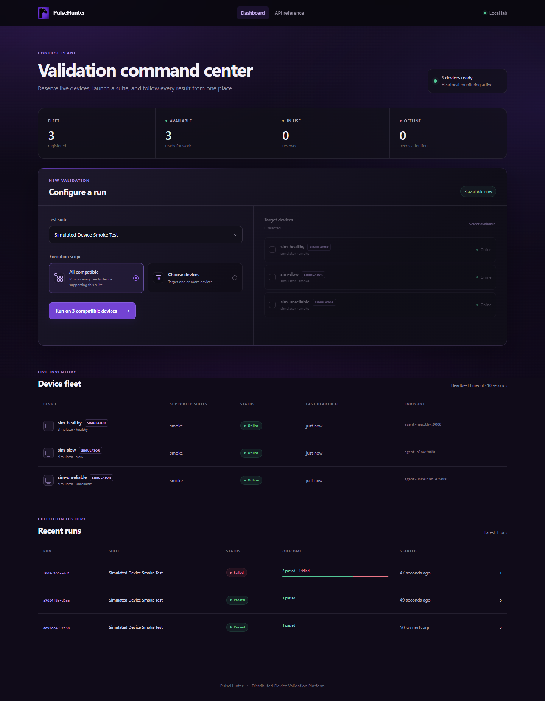
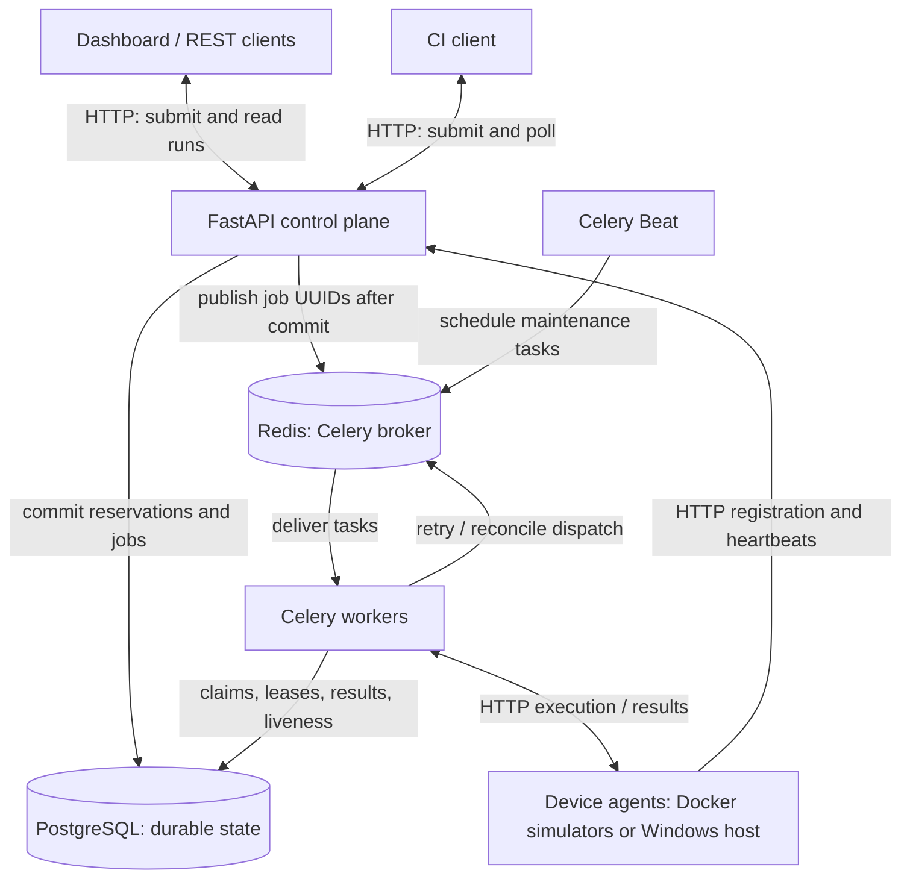
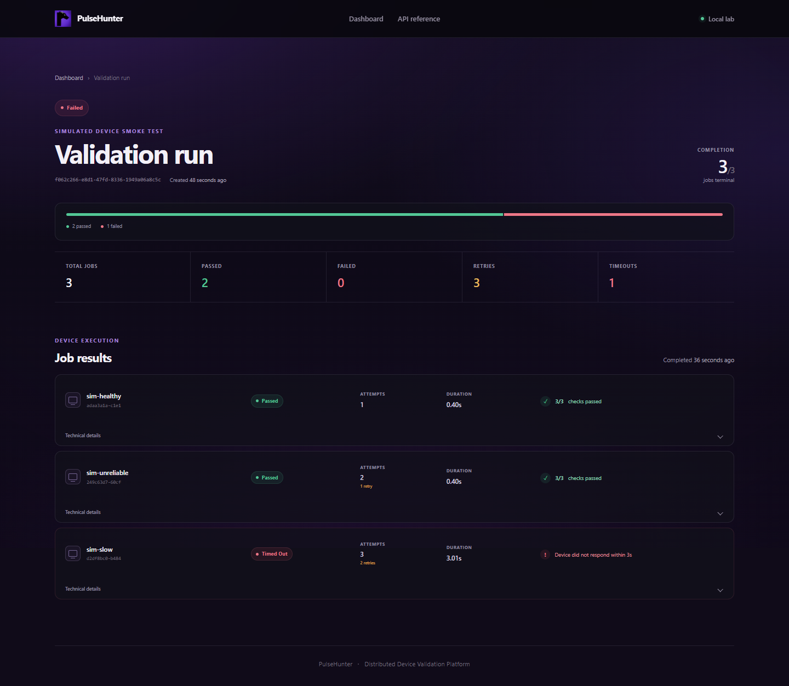

# PulseHunter

[](https://github.com/MdFahimBashar/PulseHunter/actions/workflows/ci.yml)

**Distributed device validation, from a dashboard or a CI pipeline.**

PulseHunter schedules concurrent validation jobs across networked agents,
reserves each device exclusively, and preserves results when jobs fail or
workers disappear. It brings device availability, execution, retries, and
results into one control plane instead of requiring engineers to coordinate
machines and inspect them individually. Run the full system with three Docker
simulators, or connect the Windows host agent for real system and integrity
checks. An independent project by **Md Fahim Bashar**.



*Actual local Docker execution. The fleet above contains simulators;
physical Windows-laptop acceptance was verified separately.*

[Quick start](#quick-start) · [Live demo](docs/demo.md) ·
[Architecture](docs/architecture.md) · [Deadlock investigation](docs/concurrency-deadlocks.md)

## What it does

- **Coordinate a device fleet:** registration, heartbeats, online/busy/offline
  state, exclusive reservation, and compatible-device selection in the dashboard.
- **Execute and recover:** concurrent Celery workers, bounded exponential
  retries, HTTP deadlines, database leases, and reconciliation after worker loss.
- **Keep durable evidence:** PostgreSQL stores run/job state, attempts, results,
  logs, errors, timing, and optional source-commit metadata.
- **Gate CI builds:** a CLI submits a run, waits for the aggregate outcome,
  prints per-device results, and returns a meaningful process exit code.
- **Validate a physical host:** the Windows agent performs bounded CPU/system
  inventory, memory/storage integrity, network, battery, and uptime checks.

## Architecture



The dashboard is served by FastAPI; it is not another service. Beat schedules
maintenance through Redis, and workers perform the database operations.
Redis holds task messages, **not permanent results**. Agents execute checks in
separate processes; workers release database transactions before making HTTP
calls. [Execution sequence, state machines, and failure model →](docs/architecture.md)

## Engineering decisions

| Concern | Implementation |
|---|---|
| Two runs want the same device | Ordered PostgreSQL row locks with `SKIP LOCKED`; reservation and job creation commit together. Retries keep the reservation. |
| Duplicate delivery or a late worker result | A locked job claim, lease, and matching task owner protect durable state; terminal results cannot be overwritten. |
| Worker dies or queue publication fails | Workers reconcile expired leases and committed queued jobs through periodic tasks scheduled by Beat. |
| Repeated transient errors or a slow device | Capped exponential backoff, per-device HTTP deadlines, and a finite attempt budget; terminal jobs release their devices. |
| Concurrent job results update one run | `FOR NO KEY UPDATE` serializes aggregate writers while allowing foreign-key key-share locks. |

Delivery is **at least once**. Agent execution deduplication is process-local;
an agent restart loses that cache. The system does not promise exactly-once
physical execution. [Correctness tests and lock analysis →](docs/concurrency-deadlocks.md)

## Performance investigation: reproduce, diagnose, correct

Concurrent job updates exposed a PostgreSQL lock-upgrade cycle on their shared
parent run. A synchronized regression reproduced it; changing the aggregation
lock from `FOR UPDATE` to `FOR NO KEY UPDATE` removed the observed conflict
while preserving writer serialization and device exclusivity.

| Recorded simulator measurement | Before | After |
|---|---:|---:|
| Throughput, 4 execution slots | 2.662 jobs/s | 9.032 jobs/s |
| Throughput, 8 execution slots | 0.201 jobs/s | 16.566 jobs/s |
| Completed jobs, 8 slots | 27/80 | 80/80 |
| Unfinished jobs, 8 slots | 53/80 | 0/80 |
| PostgreSQL deadlock reports, all load stages including warm-up | 249 | 0 |


The **82.4× eight-slot improvement is recovery from a deadlock-degraded
baseline**, not 82× scaling of an already healthy system. Each level used five
batches of 16 jobs; slots are prefork processes in one Celery worker container.
The 53 unfinished baseline jobs remain in the findings. These short simulated
trials are not production traffic or physical-hardware capacity measurements.
Worker-interruption recovery averaged **8.16 → 9.27 seconds**; that metric did
not improve. The release review passed **73 Docker-backed tests** and **60/60
repeated concurrency checks**.

[Root cause, latency percentiles, fault trials, and trade-offs](docs/concurrency-deadlocks.md) ·
[Original raw data](docs/benchmarks/baseline-2026-10-08/raw.json) ·
[After raw data](docs/benchmarks/after-deadlock-fix-2026-10-09/raw.json) ·
[Structured comparison](docs/benchmarks/comparison-2026-10-09/comparison.json)

## Quick start

Install Docker with Linux containers and Docker Compose, then:

```bash
git clone https://github.com/MdFahimBashar/PulseHunter.git
cd PulseHunter
docker compose up --build --detach --wait
```

Open the **[dashboard](http://127.0.0.1:8000/)** and wait for the three simulators
to appear online. Select **Simulated Device Smoke Test**, choose **All compatible**,
and launch a run. Healthy passes on attempt 1; unreliable recovers on attempt 2;
slow times out after attempt 3. The aggregate run intentionally **fails**,
making bounded retries and timeout handling visible. For a passing run, choose
only `sim-healthy`.

[Swagger / API explorer](http://127.0.0.1:8000/docs) ·
[Dependency health](http://127.0.0.1:8000/health) ·
[Setup, shutdown, and troubleshooting](docs/development.md)

No `.env` file or host Python installation is needed for Docker startup.
PostgreSQL and Redis stay on the internal network; the API binds to localhost.
Stop with `docker compose down` to preserve the database.

## See execution and recovery

With the stack running and Python 3.14 installed, run this from the repository
root (standard library only):

```bash
python -m scripts.demo
```

It verifies registration, runs a healthy job, exercises the unreliable agent's
configured HTTP 503 and recovery, then launches the three-device mixed run.
It prints real run links, state changes, attempt counts, and final outcomes.
Exit `0` means the **demonstration's expected behavior** was verified, including
the intentional timeout. [Recording checklist and screenshot provenance →](docs/demo.md)

<details>
<summary>See the persisted per-device outcomes</summary>



</details>

## CI integration

Install the package with `python -m pip install .` from a clone. A trusted CI
runner that can reach the server can use:

```bash
pulsehunter-ci run --server "$PULSEHUNTER_URL" --suite smoke \
  --device-id "$PULSEHUNTER_DEVICE_ID" --wait --timeout 120
```

With `--wait`, exit `0` means validation passed; any nonzero exit fails the build.
Optional source metadata links the persisted run to a repository, commit, ref,
and build ID. [Exit codes and configuration](docs/ci-integration.md) ·
[Copyable GitHub Actions example](examples/github-actions-device-validation.yml)

## Tests and reproducibility

Python 3.14; install development tools with `python -m pip install -e ".[dev,benchmark]"`
inside a virtual environment, then:

```bash
ruff check .
ruff format --check .
mypy src benchmarks
pytest -W error
python scripts/verify_e2e.py --timeout 90
python scripts/verify_ci.py --timeout 90
```

The last two commands require the running Compose stack. Local pytest skips
seven service-dependent cases unless explicitly enabled; GitHub Actions runs
those against PostgreSQL/Redis and separately builds and exercises the complete
Docker stack. [Development and real-service test instructions →](docs/development.md)

The isolated benchmark measures 1/2/4/8 slots and repeats missed-heartbeat,
transient-error, timeout, and interrupted-worker trials:

```bash
python -m benchmarks.run --output .benchmark-results/my-run --trials 5 --fault-trials 5 --fleet 16 --concurrency 1 2 4 8
python -m benchmarks.report .benchmark-results/my-run/raw.json --output .benchmark-results/my-run
python -m benchmarks.compare docs/benchmarks/baseline-2026-10-08 .benchmark-results/my-run --output .benchmark-results/my-comparison
```

Use a new output folder. The harness owns a separate Docker project and volumes;
no application database is reused. [Methodology, environment, and cleanup →](docs/benchmarks.md)

## Scope and limitations

- **Simulators:** deterministic healthy, slow, and transient-failure agents;
  all published performance numbers use these simulated workloads.
- **Physical hardware:** the Windows host agent was manually verified on one
  laptop over a LAN, including persisted results and offline/reconnect behavior.
  CI tests its contract, not a physical laptop. [Windows setup →](docs/windows-host-agent.md)
- **Deployment:** trusted local networks only. No authentication, authorization,
  or TLS; registered endpoint URLs are trusted. Read [SECURITY.md](SECURITY.md).
- **Scheduling:** dashboard compatibility filtering is implemented; API-level
  capability matching, priorities, and cancellation are not. API/CLI callers
  should select compatible devices explicitly. No firmware flashing is provided.

Future work: authenticated agent enrollment and TLS, durable agent idempotency,
capability-aware scheduling, and separately tested Raspberry Pi/microcontroller
integrations. [Implementation status](PROJECT_STATUS.md) · [API reference](docs/api.md) ·
[MIT license](LICENSE)
