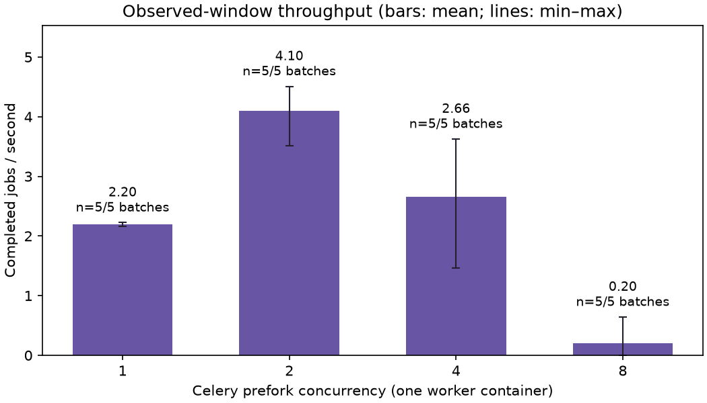
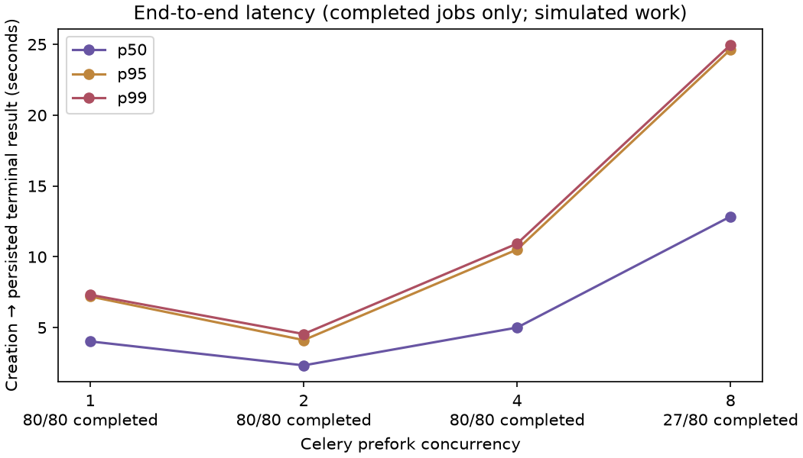
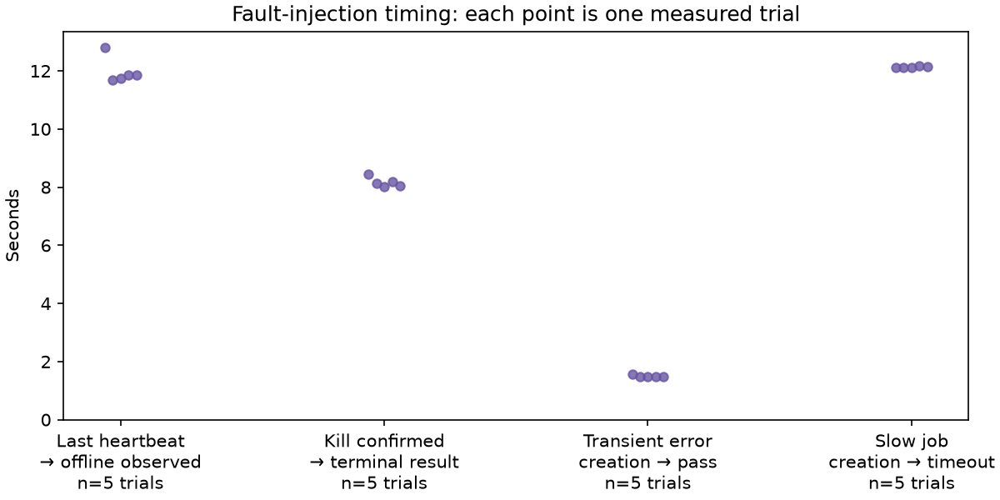
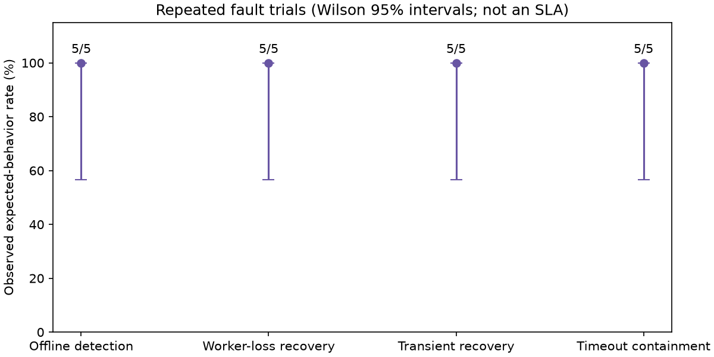

# Performance and fault-injection benchmarks

This suite exercises the existing FastAPI → PostgreSQL → Redis/Celery → HTTP
agent execution path. It does not replace the executor or tune production
timeouts, leases, database transactions, or retry policy. All benchmark agents
are **simulators**; physical Windows-host performance is not measured.

## Reproduce

Run from the repository root with Python 3.14 and Docker Desktop/Linux containers
running. Stop other heavy workloads for a quieter comparison. The isolated
stack needs ports **18080** (API) and **15432** (read-only database observation).
No physical-agent endpoint is configured or contacted.

```powershell
python -m venv .venv
.venv\Scripts\Activate.ps1
python -m pip install -e ".[dev,benchmark]"
python -m benchmarks.run --output .benchmark-results/my-baseline --trials 5 --fault-trials 5 --fleet 16 --concurrency 1 2 4 8
python -m benchmarks.report .benchmark-results/my-baseline/raw.json --output .benchmark-results/my-baseline/charts
```

On Linux/macOS, activate with `source .venv/bin/activate`; the Python commands
are identical. Use a **new, empty output directory** for each experiment.
The runner exits nonzero if any trial has unexpected behavior or misses its
deadline. Generate the report even after that exit: failures are measurements,
not permission to omit samples. Infrastructure/preflight errors are also
reported, but are not performance measurements.

The runner derives its stack from `compose.yaml` resolved against `.env.example`,
ignoring shell `PULSEHUNTER_*`, `POSTGRES_*`, and `COMPOSE_*` overrides. It uses
the separate `pulsehunter-benchmark` project, image, network, and volumes; it
rejects host/external volume mounts and refuses existing benchmark resources.
API/database ports bind only to localhost. Normal PulseHunter volumes are never
used. A fresh database is created per concurrency level and before fault trials;
an incomplete batch is preserved before resetting the benchmark stack so its
backlog cannot poison the next trial. Resets are recorded in `raw.json`.

Cleanup is automatic, including **disposable benchmark volumes**. Add
`--keep-stack` to leave the final benchmark stack available for diagnosis.
After an interrupted run, remove only that isolated stack using its saved config:

```powershell
docker compose -p pulsehunter-benchmark -f .benchmark-results/my-baseline/compose.generated.json down --volumes --remove-orphans
```

Never replace this with a normal `docker compose down --volumes` if you want to
preserve your application database. Generated configs/logs stay ignored because
they can contain local build paths and verbose operational details.

## Workload and measurements

“1, 2, 4, 8 workers” means **Celery prefork execution processes in one worker
container**, not four different deployments or eight worker containers. Beat
remains active, with the same queue and maintenance schedule as the application.
The load fleet contains 16 separate HTTP simulator processes, each doing the
existing 0.4-second healthy smoke workload. Every batch creates one real API run
and one persisted job per device. One warm-up batch per concurrency is retained
but excluded from headline statistics; five subsequent batches give 80 requested
jobs per level. Batches are closed-loop, not a sustained/open-loop arrival stream.

- **Observed-window throughput (headline/chart):** completed jobs divided by
  earliest persisted creation → final completion for a terminal batch, or
  earliest creation → final database observation for an incomplete batch. A
  created batch with zero completions measures zero throughput in that window;
  an uncreated/rejected batch is unavailable, not invented zero throughput.
  Charts show arithmetic mean and min–max across measured windows. The JSON also
  retains **fully completed batch throughput** separately. Requested, submitted,
  and completed counts and completion/pass-rate denominators retain failures;
  do not quote throughput without those denominators.
- **End-to-end latency:** durable `completed_at - created_at`, including queue,
  HTTP work, retries, and persistence. p50/p95/p99 use linear interpolation
  (Hyndman–Fan type 7) across completed jobs. The 30-second load observation
  deadline is a harness deadline, not a changed production timeout. Nonterminal
  samples are right-censored: percentiles are conditional on observed completion,
  and cannot describe the tail of an incomplete batch.
- **Admission:** explicit-device reservation can return HTTP 409. The client
  retries only that response for up to 15 seconds, with 0.2-second spacing,
  retaining every conflict response, attempt count, and admission time. Other API
  failures are not blindly retried. Durable job latency excludes pre-creation
  admission; `client_wall_seconds` records the broader client-observed batch time.
- **Offline detection:** pause the original healthy agent without unregistering
  it. Observe PostgreSQL using read-only SQL, not `/devices` or the dashboard:
  those reads can mark stale devices offline and would bias a Beat-only test.
  Report last persisted heartbeat → first observed offline state. Retain the
  previous online observation as a lower bound, plus fault-confirmation →
  detection timing. Unpause and verify reconnection before the next trial.
- **Transient failure:** the existing unreliable agent returns one HTTP 503,
  then succeeds. Expect `passed`, two attempts, and released/online device.
- **Timeout containment:** the existing slow agent takes 20 seconds; the worker
  has a 3-second HTTP timeout, at most three attempts, and 1/2-second backoffs.
  Expect `timed_out`, three attempts, a failed aggregate run, and released device.
  This is successful containment, **not successful validation or recovery**.
- **Interrupted worker:** a separate healthy simulator takes two seconds to
  provide an interruption window. Wait for a durable running attempt, SIGKILL
  the worker container, then immediately restart it. Measure confirmed kill →
  durable terminal completion. Preserve the original lease/task ownership and
  sampled recovery state; require a pass on attempt two after lease expiration,
  with device release. The agent itself is not killed, so its existing in-memory
  idempotency can return the cached result. This does not prove agent-restart or
  broker-loss recovery.

Each fault has five independent injected trials at concurrency four. Job/run
state is sampled every 0.1 seconds plus query overhead. Fast intermediate
transitions can be missed; stored attempts, initial lease, final status and
timestamps are authoritative. Offline timing has an observation interval, not
millisecond precision. Host monotonic timing is used for deadlines; durable
timestamps and PostgreSQL observation timestamps share the Docker VM clock.

`raw.json` preserves per-trial runs, final jobs, observations, errors, fault
timestamps, environment, image IDs, resolved settings, dependency versions and
Git revision/dirty status. `jobs.csv` is a flat job table; `summary.json` contains
sample sizes, percentiles, attempts, rates, and Wilson 95% intervals. Four SVG/PNG
charts show throughput, latency, fault timing, and fault-rate uncertainty.
Five successes out of five have a Wilson lower bound of approximately **56.6%**,
not evidence of a 100% production reliability guarantee. Job observations within
a batch share infrastructure and are not statistically independent trials.
The baseline uses an interactive Windows workstation: background activity was
not controlled or CPU-profiled. Small samples and batch effects make p99 an
exploratory sample percentile, not a production tail-latency guarantee.

Images/dependencies are version ranges in the existing project. Exact versions
and image IDs are captured, but rebuilding later may resolve newer dependencies.
Keep the local benchmark image or archive it externally if byte-identical replay
is required; this suite guarantees a repeatable method, not identical timings.

## Bottlenecks and interpretation

Healthy work alone has a nominal ceiling of `concurrency / 0.4` jobs/second.
That is a workload arithmetic bound, **not measured system capacity**. Publishing,
transactions, HTTP clients, aggregation, maintenance traffic, heartbeat writes,
Docker/WSL scheduling, and finite batches all add overhead. If PostgreSQL logs
show deadlocks, retain the evidence and report the regression rather than
disabling reconciliation or weakening locks to obtain a better chart.

Recommended follow-up is to inspect consistent lock ordering across job claims,
completion, and run aggregation; profile database waits and duplicate publication
before changing the execution path. A separate reviewed correctness fix should
include deterministic concurrent-transaction tests and the same benchmark rerun.
Then use larger fleets, longer repeated trials, randomized concurrency order,
and resource profiling before making capacity or tail-latency claims. A physical
host/LAN benchmark must be a separately labeled workload with actual hardware
trials, not inferred from these simulator measurements.

## Recorded baseline — 2026-10-08 (Eastern)

The experiment started at `2026-10-09T03:23:52.997326+00:00` on application
revision `a29afc5` with uncommitted benchmark tooling. Source hashes and dirty
status are retained in the raw capture. Environment: Windows 10 build 19045,
AMD Ryzen 5 3600 (6 physical / 12 logical cores), about 15.9 GiB host RAM;
Docker's WSL2 VM reported 12 CPUs and 7.7 GiB RAM. Docker Engine 29.8.0,
Compose v5.5.1, PostgreSQL 17.11, Redis 7.4.11, container Python 3.14.8,
Celery 5.6.3, FastAPI 0.143.0, SQLAlchemy 2.0.54. Host Python was 3.14.5.

The unchanged example configuration used 2-second heartbeats, a 10-second
freshness threshold, 3-second liveness scans, 2-second reconciliation,
3-second simulator HTTP timeouts, 5-second lease grace, and three attempts
with 1/2-second exponential backoffs. There were **zero physical-hardware
benchmark trials**.

Five measured batches × 16 requested jobs per concurrency:

| Execution slots | Mean observed jobs/s | Completed batches | Completed jobs | E2E p50 | E2E p95 | E2E p99 |
|---|---:|---:|---:|---:|---:|---:|
| 1 | 2.199 | 5/5 | 80/80 | 4.027 s | 7.196 s | 7.318 s |
| 2 | 4.097 | 5/5 | 80/80 | 2.336 s | 4.121 s | 4.548 s |
| 4 | 2.662 | 5/5 | 80/80 | 5.005 s | 10.514 s | 10.931 s |
| 8 | 0.201 | 1/5 | 27/80 | 12.845 s | 24.633 s | 24.961 s |

At eight slots, **53 jobs were still nonterminal at the 30-second observation
deadline**. Its percentiles use only the 27 observed completions and cannot
represent the missing tail. Completed-batch-only throughput at eight slots was
0.641 jobs/s (`n=1`), versus 0.201 jobs/s across all five observation windows.
The eight-slot warm-up also missed the deadline and is retained separately.
All observed completed load jobs passed on attempt one. Rolled-back database
claims do not increment the durable attempt counter, so “attempt one” does
not mean there was no database failure.

The load-stage evidence contains PostgreSQL `DeadlockDetected` failures involving
`test_runs ... FOR UPDATE`. Two slots outperformed four; eight was substantially
worse and unreliable within the measurement window. This is a real baseline
limitation, not evidence that adding workers scales the current implementation.
One measured two-slot admission required a 409 retry. Earlier diagnostic harness
runs also encountered a reservation conflict and incomplete high-concurrency
work; those scratch captures remain local and are **not pooled** into this
method's baseline.

Repeated faults (five trials each; latency definitions above):

| Fault | Mean latency | Min–max | Expected behavior | Durable attempts | Validation passed |
|---|---:|---:|---:|---:|---:|
| Missed heartbeats | 11.986 s | 11.683–12.791 s | 5/5 detected and reconnected | N/A | N/A |
| Transient HTTP 503 | 1.493 s | 1.468–1.561 s | 5/5 recovered | 2 | 5/5 |
| Slow-agent timeout | 12.128 s | 12.106–12.163 s | 5/5 bounded and released | 3 | 0/5 (intentional timeout) |
| SIGKILL worker | 8.164 s | 8.013–8.435 s | 5/5 recovered and released | 2 | 5/5 |

The timeout observations captured both 1- and 2-second scheduled backoffs;
transient observations captured the 1-second backoff. All worker-loss trials
captured `WorkerLeaseExpired` and completed after the initial lease expired.
The fault recovery rates do not override the failed high-concurrency results.
Every 5/5 expected-behavior rate has Wilson 95% bounds of 56.6–100%.

Portable evidence: [raw capture](benchmarks/baseline-2026-10-08/raw.json),
[summary](benchmarks/baseline-2026-10-08/summary.json),
[job CSV](benchmarks/baseline-2026-10-08/jobs.csv),
[log diagnostic counts](benchmarks/baseline-2026-10-08/diagnostics.json), and
[report provenance](benchmarks/baseline-2026-10-08/report-manifest.json).
Logs are local/ignored; diagnostic counts are per snapshot, can overlap, and
include warm-up. For example, the four-slot stage snapshot contains 38 database
deadlock reports; the two-slot snapshot contains two. Eight-slot resets produce
separate snapshots, so their counts must not be naively summed with stage logs.









Verification after the measurement: Ruff, format check, and `mypy src benchmarks`
passed. Full local pytest passed 59 tests with the one live-service test skipped;
the built Python 3.14.8 Docker image passed **all 60 tests** against the isolated
PostgreSQL/Redis stack. Most domain/API tests use SQLite fixtures; the live-service
test checks real schema/connectivity. The benchmark, not those SQLite tests,
exercises actual concurrent PostgreSQL job transactions. Compose validation,
image build, repeated fresh migrations/startup, Alembic drift check, repeated
seeding, existing three-agent E2E, and CI-client success/failure gating passed.
Health, dashboard, run detail, Swagger, and OpenAPI returned successfully.
This baseline-time verification was local; pull-request workflow checks provide
separate release verification.

The benchmark command itself returned **exit 1** because four measured eight-slot
batches and its warm-up exceeded the observation deadline. Do not describe this
baseline as “all benchmarks passed.” The next priority is a separately reviewed
concurrent-transaction correctness fix, followed by an identical baseline rerun.
